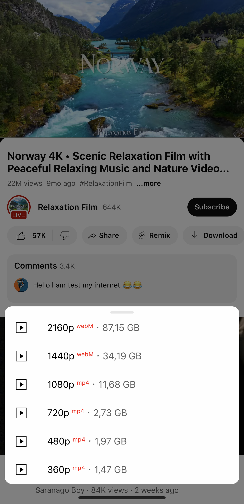
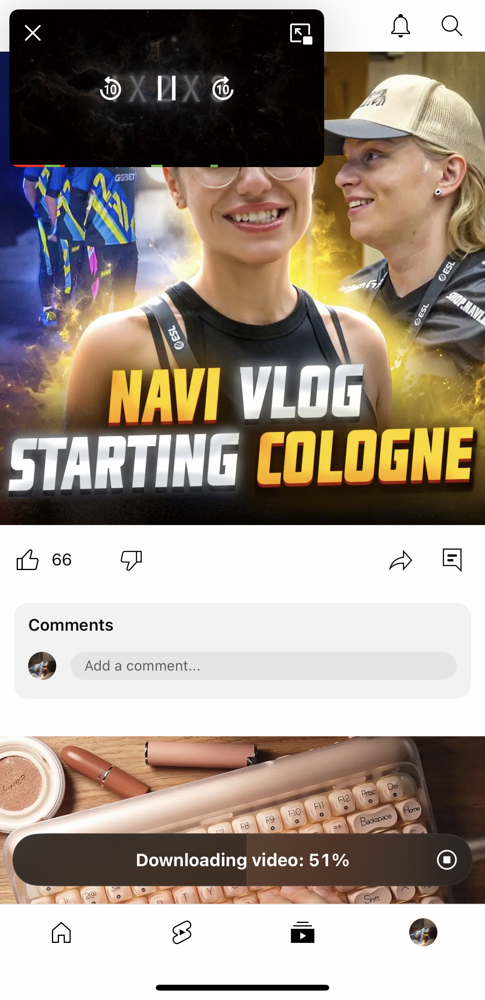
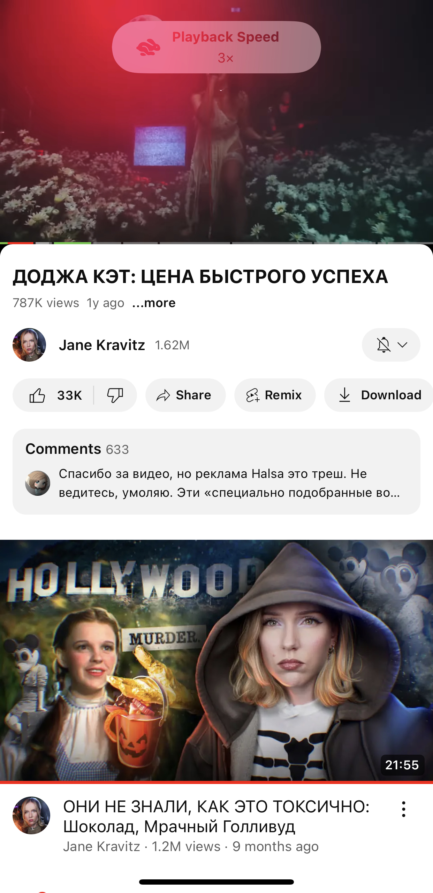
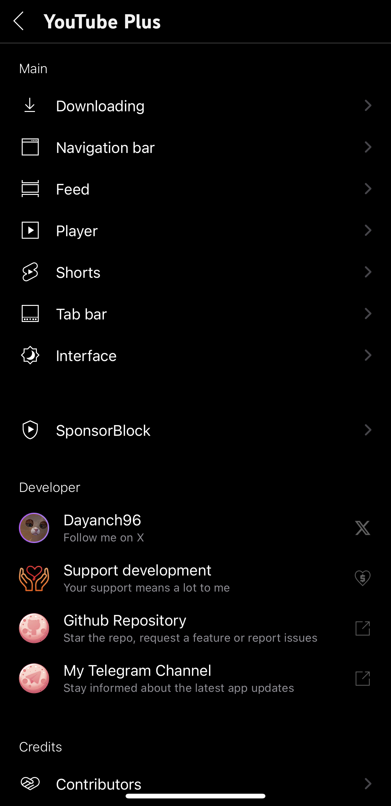
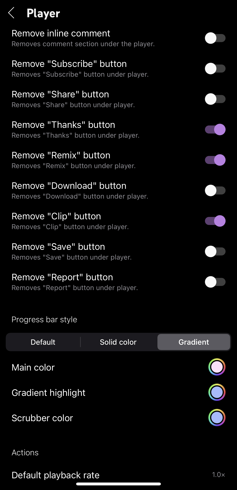
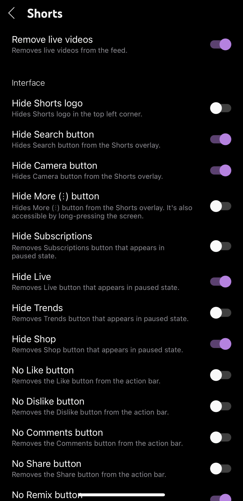
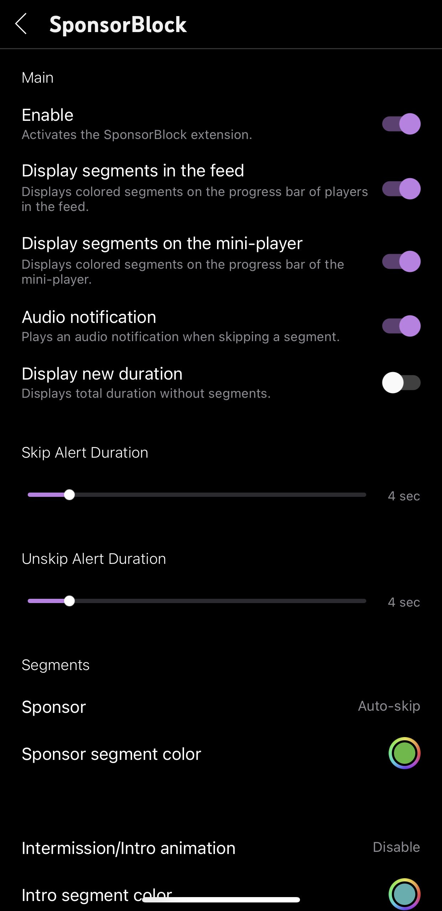
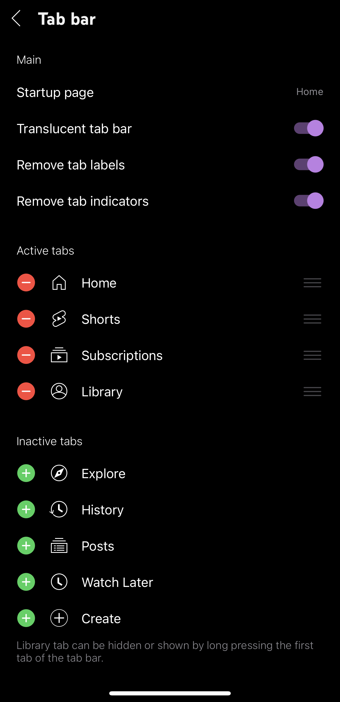
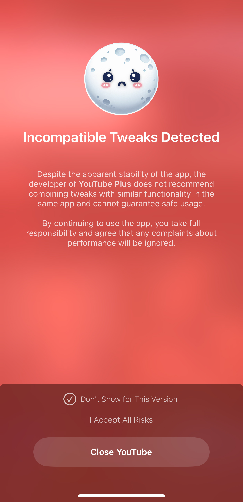

# YouTube Plus (ex. YTLite)
A flexible enhancer for YouTube on iOS, featuring over hundred customizable options.

## Table of Contents
- [Screenshots](#screenshots)
- [Main Features](#main-features)
- [FAQ](#faq)
- [Reviews](#reviews)
- [How to build a YouTube Plus app using GitHub Actions](#how-to-build-a-youtube-plus-app-using-github-actions)
- [Supported YouTube Version](#supported-youtube-version)
- [Tweak Integration Details](#tweak-integration-details)

## Screenshots
<table>
   <tr>
      <td></td>
      <td></td>
      <td></td>
   </tr>
</table>

  
More screenshots

  <table>
    <tr>
      <td></td>
      <td></td>
      <td></td>
    </tr>
    <tr>
      <td></td>
      <td></td>
      <td></td>
    </tr>
  </table>

## Main Features
<li>Download videos, audio (including audio track selection), thumbnails, posts, and profile pictures</li>
<li>Copy video, comment, and post information</li>
<li>Interface customization: Remove feed elements, reorder tabs, enable OLED mode, and as use Shorts-only mode</li>
<li>Player settings: Gestures, default quality, preferred audio track</li>
<li>Save, Load and Restore settings. Clear cache once or automatically on app startup</li>
<li>Built-in SponsorBlock</li>
<li>And much, much more</li>
 

**YouTube Plus preferences can be found in the YouTube Settings**

**All contributors are listed in the Contributors section**
**Used open-source libraries are listed in the Open Source Libraries section**

## FAQ
- [🇺🇸 English FAQ](FAQs/FAQ_EN.md)
- [🇷🇺 ЧаВо на Русском](FAQs/FAQ_RU.md)
- [🇮🇹 FAQ in Italiano](FAQs/FAQ_IT.md)
- [🇵🇱 FAQ po polsku](FAQs/FAQ_PL.md)

## Reviews
Review by [@qbap](https://github.com/qbap) on ONE Jailbreak: https://onejailbreak.com/blog/youtube-plus/

## How to build a YouTube Plus app using Github actions
> [!NOTE]
> If this your first time, complete following steps before starting:
>
> 1. Fork this repository using the fork button on the top right
> 2. On your forked repository, go to **Repository Settings** > **Actions**, enable **Read and Write** permissions.

  
How to build the YouTube Plus app

  <ol>
    <li>Click on <strong>Sync fork</strong>, and if your branch is out-of-date, click on <strong>Update branch</strong>.</li>
    <li>Navigate to the <strong>Actions tab</strong> in your forked repository and select <strong>Create YouTube Plus app</strong>.</li>
    <li>Click the <strong>Run workflow</strong> button located on the right side.</li>
    <li>Mark or unmark the tweaks you want to integrate. Learn more about them in the <a href="#tweak-integration-details">Tweak Integration Details</a> section.</li>
    <li>Prepare a decrypted .ipa file <em>(we cannot provide this due to legal reasons)</em>, then upload it to a file provider (e.g., filebin.net, filemail.com, or Dropbox is recommended). Paste the URL of the decrypted IPA file in the provided field.</li>
    <li><strong>NOTE:</strong> Make sure to provide a direct download link to the file, not a link to a webpage. Otherwise, the process will fail.</li>
    <li>Enter the tweak version from the releases (the latest release is selected by default). You can also change the BundleID and Display Name if desired.</li>
    <li>Make sure all inputs are correct, then click <strong>Run workflow</strong> to start the process.</li>
    <li>Wait for the build to finish. You can download the YouTube Plus app from the releases section of your forked repo. (If you can't find the releases section, go to your forked repo and add /releases to the URL, i.e., github.com/user/YTLite/releases.)</li>
  </ol>

  
How to build the YouTube Plus app with your own link for the YouTube Plus tweak

  <ol>
    <blockquote>
      
<strong>NOTE:</strong> This option is primarily intended for building the YouTube Plus app based on the beta file you have. In other cases, it is generally not needed.

    </blockquote>
    <li>Click on <strong>Sync fork</strong>, and if your branch is out-of-date, click on <strong>Update branch</strong>.</li>
    <li>Navigate to the <strong>Actions tab</strong> in your forked repository and select <strong>[BETA] Build YouTube Plus app</strong>.</li>
    <li>Click the <strong>Run workflow</strong> button located on the right side.</li>
    <li>Mark or unmark the tweaks you want to integrate. Learn more about them in the <a href="#tweak-integration-details">Tweak Integration Details</a> section.</li>
    <li>Prepare a decrypted .ipa file <em>(we cannot provide this due to legal reasons)</em>, then upload it to a file provider (e.g., filebin.net, filemail.com, or Dropbox is recommended). Paste the URL of the decrypted IPA file in the provided field.</li>
    <li>Upload your beta tweak file to a file provider and paste direct link to the <strong>URL to the YouTube Plus tweak file</strong> field. You can also change the BundleID and Display Name if desired.</li>
    <li><strong>NOTE:</strong> Make sure to provide a direct download link to the file, not a link to a webpage. Otherwise, the process will fail.</li>
    <li>Make sure all inputs are correct, then click <strong>Run workflow</strong> to start the process.</li>
    <li>Wait for the build to finish. You can download the YouTube Plus app from the releases section of your forked repo. (If you can't find the releases section, go to your forked repo and add /releases to the URL, i.e., github.com/user/YTLite/releases.)</li>
  </ol>

## Supported YouTube Version
<ul>
   <li><strong>Latest confirmed:</strong> <em>20.42.3</em></li>
   <li><strong>Date tested:</strong> <em>Nov 5, 2025</em></li>
   <li><strong>YouTube Plus:</strong> <em>5.2 beta 4</em></li>
</ul>

## Tweak Integration Details

  
YouPiP

  
YouPiP is a tweak developed by <a href="https://github.com/PoomSmart">PoomSmart</a> that enables the native Picture-in-Picture feature for videos in the iOS YouTube app.

  
<strong>YouPiP preferences</strong> are available in the <strong>YouTube settings</strong>.

  
Source code and additional information are available <a href="https://github.com/PoomSmart/YouPiP">in PoomSmart's GitHub repository</a>.

  
YTUHD

  
YTUHD is a tweak developed by <a href="https://github.com/PoomSmart">PoomSmart</a> that unlocks 1440p (2K) and 2160p (4K) resolutions in the iOS YouTube app.

  
<strong>YTUHD preferences</strong> are available in the <strong>Video quality preferences</strong> section under <strong>YouTube settings</strong>.

  
Source code and additional information are available <a href="https://github.com/PoomSmart/YTUHD">in PoomSmart's GitHub repository</a>.

  
Return YouTube Dislikes

  
Return YouTube Dislikes is a tweak developed by <a href="https://github.com/PoomSmart">PoomSmart</a> that brings back dislikes on the YouTube app.

  
<strong>Return YouTube Dislikes preferences</strong> are available in the <strong>YouTube settings</strong>.

  
Source code and additional information are available <a href="https://github.com/PoomSmart/Return-YouTube-Dislikes">in PoomSmart's GitHub repository</a>.

  
YouQuality

  
YouQuality is a tweak developed by <a href="https://github.com/PoomSmart">PoomSmart</a> that allows to view and change video quality directly from the video overlay.

  
<strong>YouQuality can be enabled</strong> in the <strong>Video overlay</strong> section under <strong>YouTube settings</strong>.

  
Source code and additional information are available <a href="https://github.com/PoomSmart/YouQuality">in PoomSmart's GitHub repository</a>.

  
DontEatMyContent

  
DontEatMyContent is a tweak developed by <a href="https://github.com/therealFoxster">therealFoxster</a> that prevents the Notch/Dynamic Island from munching on 2:1 video content in the iOS YouTube app.

  
<strong>DontEatMyContent preferences</strong> are available in the <strong>YouTube settings</strong>.

  
Source code and additional information are available <a href="https://github.com/therealFoxster/DontEatMyContent">in therealFoxster's GitHub repository</a>.

