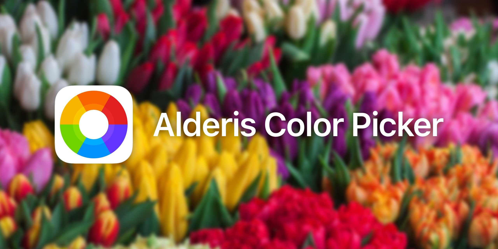

# 

**<center>Try it yourself: `pod try Alderis`</center>**

Alderis is a fresh new color picker, with a gentle, fun, and dead simple user interface. It aims to incorporate the usual elements of a color picker, in a way that users will find easy and fun to use.

The user can start by selecting a color they like on the initial color palette tab, and either accept it, or refine it using the color wheel and adjustment sliders found on the two other tabs.

Alderis is named for the Alderamin (Alpha) star in the Cepheus (Cephei) constellation. (There is no dependency on the [Cephei](https://hbang.github.io/libcephei/) project.)

## Why do I want this? Isn’t there already a color picker in iOS?
Alderis was [originally released](https://twitter.com/hbkirb/status/1239332547437326337) before iOS 14 was unveiled with a built-in [color picker](https://developer.apple.com/design/human-interface-guidelines/ios/controls/color-wells/) feature, which seems to be heavily inspired by Alderis. However, rather than throw in the towel here, I’m considering this an opportunity to continue building what I feel is a better, less cluttered user experience, with more configuration options for apps to fine-tune a color picker UI suitable for each use case and target market.

If this doesn’t seem important to you, the answer is simple: skip Alderis and use [UIColorPickerViewController](https://developer.apple.com/documentation/uikit/uicolorpickerviewcontroller). If it does, read on.

### Feature Comparison

<table>
<tr> <th></th> <th>Alderis</th> <th>UIKit</th> </tr>
<tr> <th>Minimal UI</th> <td>✔️</td> <td>✖️</td> </tr>
<tr> <th>Drag and drop colors within app</th> <td>✔️</td> <td>✔️ *</td> </tr>
<tr> <th>Drag and drop colors across apps</th> <td>✔️</td> <td>✖️</td> </tr>
<tr> <th>Color grid</th> <td>✔️</td> <td>✔️</td> </tr>
<tr> <th>Color spectrum/wheel</th> <td>✔️</td> <td>✔️</td> </tr>
<tr> <th>RGB sliders</th> <td>✔️</td> <td>✔️</td> </tr>
<tr> <th>HSB sliders</th> <td>✔️</td> <td>✖️</td> </tr>
<tr> <th>Grayscale slider</th> <td>✔️</td> <td>✖️</td> </tr>
<tr> <th>Opacity slider</th> <td>✔️</td> <td>✔️</td> </tr>
<tr> <th>Hex color code support</th> <td>✔️</td> <td>✔️</td> </tr>
<tr> <th>Color space support (Display P3)</th> <td>✖️</td> <td>✔️</td> </tr>
<tr> <th>Save favorite colors</th> <td>✖️</td> <td>✔️</td> </tr>
<tr> <th>Saved colors shared across apps</th> <td>✖️</td> <td>✔️</td> </tr>
<tr> <th>Grab color from screen (eyedropper)</th> <td>✖️</td> <td>✔️</td> </tr>
<tr> <th>Customise title label</th> <td>✔️</td> <td>✖️</td> </tr>
<tr> <th>Customise tab row visibility</th> <td>✔️</td> <td>✖️</td> </tr>
<tr> <th>Customise visible tabs</th> <td>✔️</td> <td>✖️</td> </tr>
<tr> <th>Customise initially selected tab</th> <td>✔️</td> <td>✖️</td> </tr>
<tr> <th>Customise opacity slider visibility</th> <td>✔️</td> <td>✔️</td> </tr>
<tr> <th>Customise color grid</th> <td>✖️</td> <td>✖️</td> </tr>
<tr> <th>Interface Builder support</th> <td>✖️</td> <td>✖️</td> </tr>
<tr> <th>SwiftUI support w/o UIKit bridging</th> <td>✖️</td> <td>✖️</td> </tr>
<tr> <th>Observe value change with KVO</th> <td>✖️</td> <td>✔️</td> </tr>
</table>

\* UIColorWell supports dragging colors *onto* it, but not *out* of it. Alderis supports both directions, which are separately configurable. The default Alderis ColorWell behavior matches UIColorWell. Alderis supports drag and drop on the color picker window; UIKit does not.

## Installation

### CocoaPods
Add to your Podfile:

```ruby
pod 'Alderis', '~> 1.2.0'
```

And then run `pod install`.

### Carthage
Add to your Cartfile:

```ruby
github 'hbang/Alderis' ~> 1.2.0
```

And then run `carthage update`.

### Swift Package Manager
1. Click File &rarr; Swift Packages &rarr; Add Package Dependency.
2. Enter `http://github.com/hbang/Alderis.git`.
3. Specify `1.2` as the version filter.

Or, manually add it to your Package.swift:

```swift
dependencies: [
	.package(url: "http://github.com/hbang/Alderis.git", from: "1.2.0")
]
```

And then run `swift package update`.

### Jailbreak packages
Add `ws.hbang.alderis (>= 1.2)` to your `Depends:` list.

#### Preference Bundles and libcolorpicker Compatibility
Alderis acts as a drop-in replacement for [libcolorpicker](https://github.com/atomikpanda/libcolorpicker), an abandoned but still very popular color picker library on jailbroken iOS. Packages can simply change their dependencies list to replace `org.thebigboss.libcolorpicker` with `ws.hbang.alderis (>= 1.2)` to switch their color picker to Alderis. No other changes required!

For more information, refer to [the docs](https://hbang.github.io/Alderis/preference-bundles.html).

## License
Licensed under the Apache License, version 2.0. Refer to [LICENSE.md](https://github.com/hbang/Alderis/blob/main/LICENSE.md).

Header backdrop photo credit: [John-Mark Smith](https://unsplash.com/@mrrrk_smith) on Unsplash
